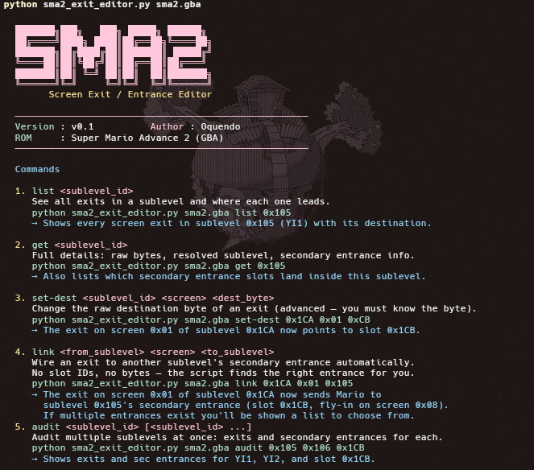

# SMA2 Screen Exit / Entrance Editor

**Author:** Oquendo · **Version:** v0.1 · **Target ROM:** Super Mario Advance 2 (GBA)

A command-line tool to read and modify screen exits and secondary entrances in Super Mario Advance 2. No GUI required — every change is one command, and all edits are written directly to your working ROM.



---

## Table of Contents

1. [Requirements & Setup](#requirements--setup)
2. [How edits are saved](#how-edits-are-saved)
3. [Main Commands](#main-commands)
4. [Advanced Commands](#advanced-commands)
5. [Common Recipes](#common-recipes)
6. [Secondary Entrance Slot Reference](#secondary-entrance-slot-reference)
7. [Technical Reference](#technical-reference)

---

## Requirements & Setup

- Python 3.8 or newer (standard library only, no pip installs needed)
- A legally-obtained Super Mario Advance 2 ROM (`sma2.gba`)

Place `sma2_exit_editor.py` anywhere. Run it from your terminal:

```
python sma2_exit_editor.py
```

Running with no arguments prints the main command guide. To see all advanced commands:

```
python sma2_exit_editor.py sma2.gba help
```

---

## How edits are saved

Every write command modifies your ROM **in-place** — the same file you pass in is the one that gets updated. There is no `_edited` copy. Make a backup of your original ROM before you start editing.

```
sma2.gba   ← edited directly, changes accumulate here
```

This means you can run multiple commands in sequence and all changes stack — nothing gets reverted.

---

## Main Commands

These seven commands cover the most common editing tasks. Run the tool with no arguments to see them with examples.

### `list` — See all exits in a level

```
python sma2_exit_editor.py sma2.gba list <level_id>
```

Shows a short table of every screen exit in the level: which screen it's on, the destination byte, whether it uses a secondary entrance slot, and where it resolves to.

```
python sma2_exit_editor.py sma2.gba list 0x05
```

### `get` — Full details

```
python sma2_exit_editor.py sma2.gba get <level_id>
```

Everything `list` shows, plus raw bytes, resolved sublevel, secondary entrance slot details, and — at the bottom — a list of every secondary entrance slot that **lands in** this sublevel. This is the best first command to run before editing anything.

```
python sma2_exit_editor.py sma2.gba get 0x05
```

Example bottom section of the output:

```
Secondary Entrances landing in this sublevel
  ──────────────────────────────────────────
  Sec slot 0x1CB  screen=0x08  x=0  y=2  anim=6 (fly in)
```

### `audit` — Audit multiple sublevels at once

```
python sma2_exit_editor.py sma2.gba audit <level_id> [<level_id> ...]
```

Shows a quick exit and secondary entrance summary for each given sublevel. Useful when planning or reviewing a set of linked levels.

```
python sma2_exit_editor.py sma2.gba audit 0x105 0x106 0x1CA
```

### `set-dest` — Change exit destination (raw byte)

```
python sma2_exit_editor.py sma2.gba set-dest <level_id> <screen> <dest_byte>
```

Changes the raw destination byte of the exit on the given screen. Use this when you already know the exact byte you need (for example, from looking at `list` or `get` output). When the level uses secondary-entrance mode, `dest_byte` is the low byte of the slot ID — **not** a sublevel.

```
# The exit on screen 0x01 of sublevel 0x1CA now points to slot 0x1CB
python sma2_exit_editor.py sma2.gba set-dest 0x1CA 0x01 0xCB
```

> **Tip:** If you just want to send an exit to another level's secondary entrance without thinking about bytes, use `link` instead.

### `link` — Wire an exit to another level automatically

```
python sma2_exit_editor.py sma2.gba link <from_level> <screen> <to_level>
```

The smart command. You say which exit you want to change and which level it should go to — the tool finds the correct secondary entrance slot for you, computes the right destination byte, and asks you to set the entrance animation. No slot IDs, no manual byte calculation.

```
# Exit on screen 0x01 of sublevel 0x1CA now sends Mario to Yoshi's Island 1
python sma2_exit_editor.py sma2.gba link 0x1CA 0x01 0x105
```

The tool will prompt you for the animation:

```
  Select entrance animation for slot 0x1CB:
  Available animations:
    0 = walk right (from left pipe)
    1 = walk left (from right pipe)
    2 = fall from above
    3 = enter pipe from top
    4 = enter pipe from bottom
    5 = enter door
    6 = fly in ← current
    7 = warp (no animation)

  Animation [0-7]:
```

Press Enter for the default (fly-in, `6`) or enter a number 0-7.

**Before:**


**After:**


If the destination level has more than one secondary entrance slot, you'll be shown a numbered list and asked to choose one first.

> `link` requires that the destination level is in secondary-entrance mode (i.e. it has at least one slot pointing to it). If no slots are found, the tool will tell you.

---

## Advanced Commands

Run `python sma2_exit_editor.py sma2.gba help` to see all of these with full descriptions and examples. Here is a quick reference:

### Screen exit commands

| Command | Arguments | Description |
|---|---|---|
| `list` | `<level_id>` | Short table of all exits in a level |
| `get` | `<level_id>` | Full details: raw bytes, resolved destinations, secondary entrances landing here |
| `audit` | `<level_id> [<level_id>...]` | Audit multiple sublevels at once |
| `set-dest` | `<level_id> <screen> <dest_byte>` | Change exit destination byte directly |
| `set-screen` | `<level_id> <old_screen> <new_screen>` | Move an exit to a different screen number |
| `link` | `<from_level> <screen> <to_level>` | Auto-wire an exit to a level's secondary entrance |

### Secondary entrance slot commands

| Command | Arguments | Description |
|---|---|---|
| `sec-info` | `<slot_id>` | Show all decoded fields of a slot |
| `sec-list` | *(none)* | List every non-empty slot in the table (grouped by slot ID) |
| `anim-list` | *(none)* | List every sublevel that has slots, grouped — shows which slots land in each sublevel and their animations |
| `slot-find` | `<sublevel_id>` | Find all secondary entrance slots that land in a given sublevel |
| `sec-set` | `<slot_id> <sublevel_low_byte>` | Change which sublevel the slot points to |
| `sec-screen` | `<slot_id> <screen>` | Change the screen Mario appears on (`0x00`–`0x1F`) |
| `sec-pos` | `<slot_id> <x> <y>` | Change Mario's tile position within the screen (0–15 each) |
| `sec-anim` | `<slot_id> <0–7>` | Change the entrance animation (takes slot ID, not sublevel) |
| `sec-edit` | `<slot_id>` | Interactive editor for all fields at once |

### Entrance animation values

| Value | Animation |
|---|---|
| `0` | Walk right (enters from left edge / left pipe) |
| `1` | Walk left (enters from right edge / right pipe) |
| `2` | Fall from above |
| `3` | Enter pipe from top (going down) |
| `4` | Enter pipe from bottom (going up) |
| `5` | Enter door |
| `6` | Fly in |
| `7` | Warp — instant, no animation |

### Slot vs Sublevel — What's the difference?

Every secondary entrance is stored as a **slot** in the slot table. Levels don't "have" animations — **slots** do.

When an exit uses secondary-entrance mode, the exit points to a **slot ID**, not a level. That slot is where the animation, screen, and tile position are stored. All exits that route through the same slot share the same entrance behavior.

```
Exit on screen 0x07 → points to slot 0x1CA → slot lands in sublevel 0x106 → anim=3
                                              ↑
                                          changing slot 0x1CA's animation
                                          changes how Mario enters YI2
```

**`sec-anim` takes a slot ID** — it doesn't ask "which level", it asks "which slot". If `sec-anim 0x1CA 6` changes it to fly-in, then every exit that sends Mario through slot 0x1CA will now show the fly-in animation when landing in YI2.

To find which slot lands in a given level, use `audit` or `get`:

```bash
python sma2_exit_editor.py sma2.gba audit 0x106
# → slot 0x1CA  screen=0x10  x=0  y=2  anim=3 (enter pipe from top)

python sma2_exit_editor.py sma2.gba sec-anim 0x1CA 6
# → changes slot 0x1CA to fly-in
```

### Level ID vs sublevel ID

The tool accepts the **level ID** for all commands. Internally these map to sublevels:

| Level ID range | Sublevel |
|---|---|
| `0x00` | `0x000` (Bonus game) |
| `0x01` – `0x5A` | `level_id + 0x100` (main overworld levels) |
| `0xB7` – `0xFF` | `level_id` (boss rooms, internal rooms) |

Arguments can be hex (`0x05`, `0x1CB`) or decimal (`5`, `459`) — the tool accepts both.

---

## Common Recipes

**Send an exit to another level's secondary entrance (the easy way):**

```bash
python sma2_exit_editor.py sma2.gba link 0x1CA 0x01 0x05
# Exit on screen 0x01 of sublevel 0x1CA → Yoshi's Island 1 secondary entrance
```

**Inspect a level before editing it:**

```bash
python sma2_exit_editor.py sma2.gba get 0x05
# Shows exits, destinations, and which slots land here
```

**Redirect a secret pipe to a completely different level:**

```bash
# Find which sec slot the pipe uses
python sma2_exit_editor.py sma2.gba get 0x05

# Point that slot to sublevel 0x106 (YI2 = low byte 0x06)
python sma2_exit_editor.py sma2.gba sec-set 0x1CB 0x06

# Change animation to walk-right
python sma2_exit_editor.py sma2.gba sec-anim 0x1CB 0
```

**Move a secondary entrance spawn point:**

```bash
# Move Mario to screen 0x0A, tile position X=8 Y=12
python sma2_exit_editor.py sma2.gba sec-screen 0x1CB 0x0A
python sma2_exit_editor.py sma2.gba sec-pos 0x1CB 8 12
```

**Edit all fields of a slot interactively:**

```bash
python sma2_exit_editor.py sma2.gba sec-edit 0x1CB
# Prompts for sublevel, screen, X, Y, animation — Enter to keep current value
```

**Audit multiple sublevels at once:**

```bash
python sma2_exit_editor.py sma2.gba audit 0x105 0x106 0x1CA
# Shows exits and secondary entrances for YI1, YI2, and sublevel 0x1CA
```

**Find which slots land in a sublevel:**

```bash
python sma2_exit_editor.py sma2.gba slot-find 0x106
# → slot 0x1CA  screen=0x10  x=0  y=2  anim=3 (enter pipe from top)
# Use this to find which slot to edit with sec-anim
```

**List every sublevel with its slots and animations:**

```bash
python sma2_exit_editor.py sma2.gba anim-list
# Shows all sublevels that have secondary entrance slots,
# grouped by sublevel — see which slots to edit
```

**Audit the entire secondary entrance table:**

```bash
python sma2_exit_editor.py sma2.gba sec-list
```

---

## Secondary Entrance Slot Reference

This table lists the known secondary entrance slots used in the vanilla SMA2 ROM, grouped by the sublevel they land in. Slot IDs in the `0x100`–`0x1FF` range point to sublevels in the `0x100`–`0x1FF` range; slots `0x000`–`0x0FF` point to sublevels `0x000`–`0x0FF`.

Use `python sma2_exit_editor.py sma2.gba sec-list` to dump the full live table from your ROM (especially useful after edits).

### World 1 — Yoshi's Island

| Slot | Sublevel | Level Name | Screen | X | Y | Animation |
|---|---|---|---|---|---|---|
| `0x1CB` | `0x105` | Yoshi's Island 1 | `0x08` | 0 | 2 | 6 — fly in |
| `0x1CC` | `0x106` | Yoshi's Island 2 | `0x01` | 0 | 8 | 4 — pipe from bottom |
| `0x1CD` | `0x103` | Yoshi's Island 3 | `0x01` | 0 | 8 | 4 — pipe from bottom |
| `0x1CE` | `0x102` | Yoshi's Island 4 | `0x01` | 0 | 8 | 4 — pipe from bottom |
| `0x1CF` | `0x101` | Iggy's Castle | `0x00` | 0 | 8 | 5 — enter door |

### World 2 — Donut Plains

| Slot | Sublevel | Level Name | Screen | X | Y | Animation |
|---|---|---|---|---|---|---|
| `0x1D0` | `0x10B` | Donut Secret 2 | `0x00` | 0 | 8 | 4 — pipe from bottom |
| `0x1D4` | `0x110` | Larry's Castle | `0x00` | 0 | 8 | 5 — enter door |

### World 3 — Vanilla Dome

| Slot | Sublevel | Level Name | Screen | X | Y | Animation |
|---|---|---|---|---|---|---|
| `0x1D8` | `0x11A` | Vanilla Dome 1 | `0x00` | 0 | 8 | 4 — pipe from bottom |
| `0x1D9` | `0x118` | Vanilla Dome 2 | `0x00` | 0 | 8 | 4 — pipe from bottom |
| `0x1DA` | `0x10A` | Vanilla Dome 3 | `0x00` | 0 | 8 | 4 — pipe from bottom |
| `0x1DB` | `0x119` | Vanilla Dome 4 | `0x00` | 0 | 8 | 4 — pipe from bottom |
| `0x1DC` | `0x109` | Vanilla Secret 1 | `0x00` | 0 | 8 | 4 — pipe from bottom |
| `0x1DD` | `0x11C` | Lemmy's Castle | `0x00` | 0 | 8 | 5 — enter door |

### World 4 — Twin Bridges / Forest of Illusion

| Slot | Sublevel | Level Name | Screen | X | Y | Animation |
|---|---|---|---|---|---|---|
| `0x1E0` | `0x11E` | Forest of Illusion 1 | `0x00` | 0 | 8 | 4 — pipe from bottom |
| `0x1E1` | `0x120` | Forest of Illusion 2 | `0x00` | 0 | 8 | 4 — pipe from bottom |
| `0x1E2` | `0x123` | Forest of Illusion 3 | `0x00` | 0 | 8 | 4 — pipe from bottom |
| `0x1E3` | `0x11F` | Forest of Illusion 4 | `0x00` | 0 | 8 | 4 — pipe from bottom |
| `0x1E4` | `0x11D` | Forest Ghost House | `0x00` | 0 | 8 | 5 — enter door |
| `0x1E5` | `0x122` | Forest Secret Area | `0x00` | 0 | 8 | 4 — pipe from bottom |
| `0x1E8` | `0x11C` | Lemmy's Castle | `0x00` | 0 | 8 | 5 — enter door |

### World 5 — Chocolate Island

| Slot | Sublevel | Level Name | Screen | X | Y | Animation |
|---|---|---|---|---|---|---|
| `0x1E9` | `0x124` | Chocolate Island 2 | `0x00` | 0 | 8 | 4 — pipe from bottom |
| `0x1EA` | `0x117` | Chocolate Secret | `0x00` | 0 | 8 | 4 — pipe from bottom |

### World 6 — Valley of Bowser

| Slot | Sublevel | Level Name | Screen | X | Y | Animation |
|---|---|---|---|---|---|---|
| `0x1F0` | `0x116` | Valley of Bowser 1 | `0x00` | 0 | 8 | 4 — pipe from bottom |
| `0x1F1` | `0x115` | Valley of Bowser 2 | `0x00` | 0 | 8 | 4 — pipe from bottom |
| `0x1F2` | `0x113` | Valley of Bowser 3 | `0x00` | 0 | 8 | 4 — pipe from bottom |
| `0x1F3` | `0x10F` | Valley of Bowser 4 | `0x00` | 0 | 8 | 4 — pipe from bottom |
| `0x1F4` | `0x114` | Valley Ghost House | `0x00` | 0 | 8 | 5 — enter door |
| `0x1F5` | `0x111` | Valley Fortress | `0x00` | 0 | 8 | 5 — enter door |
| `0x1F6` | `0x110` | Larry's Castle | `0x00` | 0 | 8 | 5 — enter door |

### Star World

| Slot | Sublevel | Level Name | Screen | X | Y | Animation |
|---|---|---|---|---|---|---|
| `0x1FA` | `0x134` | Star World 1 | `0x00` | 0 | 8 | 7 — warp |
| `0x1FB` | `0x130` | Star World 2 | `0x00` | 0 | 8 | 7 — warp |
| `0x1FC` | `0x132` | Star World 3 | `0x00` | 0 | 8 | 7 — warp |
| `0x1FD` | `0x135` | Star World 4 | `0x00` | 0 | 8 | 7 — warp |
| `0x1FE` | `0x136` | Star World 5 | `0x00` | 0 | 8 | 7 — warp |

> **Note:** The slot values for screen, X, Y, and animation above are taken from the vanilla ROM. After edits they will reflect whatever you changed. Always run `get` or `sec-info` on your current ROM to see live values.

> **Finding slots for your ROM:** Run `sec-list` to get a full dump, or `get <level_id>` to see only the slots that land in a specific level.

---

## Technical Reference

This section documents the ROM data structures the tool reads and writes. Useful if you are cross-referencing with a hex editor or writing your own tooling.

### ROM identification

The tool checks the GBA ROM header at offset `0xA0`–`0xAF`:

- Game title must contain `MARIO`
- Game code must be `AA2E` (bytes `0xAC`–`0xAF`)

If the check fails, the tool prints a warning and continues anyway.

### Layer 1 pointer table

```
ROM offset: 0x0F22CC   (GBA address 0x080F22CC)
Entry size: 4 bytes (little-endian GBA pointer)
Count:      0x209 entries
```

Each entry is a GBA pointer (`0x08xxxxxx`) to the start of that sublevel's layer 1 block. The sublevel ID is the direct index:

```
entry_offset = 0x0F22CC + sublevel_id * 4
gba_ptr      = u32_le(rom, entry_offset)
rom_offset   = gba_ptr - 0x08000000
```

### Layer 1 sublevel block layout

```
Offset  Size  Description
──────────────────────────────────────────
+0      7     Sublevel header (mode, palette, tileset, music, timer, …)
+7      …     Object data stream (variable length, terminated by 0xFF)
```

The tool skips the 7-byte header before parsing objects.

### Object stream encoding

Most objects are 3 bytes. Global objects (ID `0x00`) are 3 or 4 bytes depending on their sub-ID.

```
byte 0:  bit 7     = new_screen_flag
         bits 6-5  = objID[5:4]  (upper 2 bits of 6-bit ID)
         bits 4-0  = Y position

byte 1:  bits 7-4  = objID[3:0]  (lower 4 bits of 6-bit ID)
         bits 3-0  = X position (low digit)

byte 2:  bits 7-4  = height
         bits 3-0  = width  (or extended sub-ID when objID = 0x00)
```

Full 6-bit object ID:

```
obj_id = (byte0[6:5] << 4) | byte1[7:4]
```

When `obj_id == 0x00`, the object is a global. `byte2` is the extended sub-ID:

| Sub-ID | Size | Object |
|---|---|---|
| `0x00` | 4 bytes | Screen exit (`00.00`) |
| `0x01` | 3 bytes | Change screen number |
| anything else | 3 bytes | Other global object |

### Screen exit object (00.00) — 4-byte layout

<table>
  <tr><th>Byte</th><th>Layout</th></tr>
  <tr>
    <td><strong><font color="#FF6B6B">byte 0</font></strong></td>
    <td><code>bit 7</code>     = new_screen_flag<br>
        <code>bits 6-5</code> = 00  (part of objID = 0x00)<br>
        <code>bits 4-0</code> = screen_number  (which screen this exit covers)</td>
  </tr>
  <tr>
    <td><strong><font color="#4ECDC4">byte 1</font></strong></td>
    <td><code>bits 7-4</code> = 0000<br>
        <code>bits 3-1</code> = secondary_entrance_flag  (nonzero = secondary mode)<br>
        <code>bit  0</code>   = unused</td>
  </tr>
  <tr>
    <td><strong><font color="#95E881">byte 2</font></strong></td>
    <td><code>0x00</code>  (extended sub-ID confirming this is a screen exit)</td>
  </tr>
  <tr>
    <td><strong><font color="#FFD93D">byte 3</font></strong></td>
    <td>destination low byte</td>
  </tr>
</table>

**Legend:** <font color="#FF6B6B">byte 0</font> = screen number &nbsp;|&nbsp; <font color="#4ECDC4">byte 1</font> = secondary flag &nbsp;|&nbsp; <font color="#95E881">byte 2</font> = sub-ID &nbsp;|&nbsp; <font color="#FFD93D">byte 3</font> = destination

### Destination high bit rule

Only the low byte of the destination sublevel is stored in byte 3. The high bit (`0x100`) is inherited from the **current sublevel's** address range:

```
dest_high = 0x100 if current_sublevel >= 0x100 else 0x000
dest_full = dest_high | byte3
```

This is why a "same-level" secret pipe exit works: in sublevel `0x105`, a destination byte of `0x05` resolves to `0x105` (same sublevel, different entrance) — not to `0x005`.

Consequence: from a sublevel in the `0x100` range you cannot directly exit to a sublevel in the `0x000` range and vice versa.

When the exit is in secondary-entrance mode, `dest_full` is the **slot ID** into the secondary entrance table, not a sublevel. The `link` command handles this calculation for you automatically.

### Secondary entrance table — 5 parallel byte arrays

All five arrays have `0x200` entries (one per slot). Each is stored as a flat array of bytes at consecutive ROM addresses.

```
Table          ROM offset   GBA address    Field
────────────────────────────────────────────────────────────────────
SEC_SUBLEVEL   0x0F4744     0x080F4744     Sublevel low byte
SEC_BYTE1      0x0F4944     0x080F4944     Y position + flags
SEC_BYTE2      0x0F4B44     0x080F4B44     X position + reserved
SEC_BYTE3      0x0F4D44     0x080F4D44     Screen number
SEC_ANIM       0x0F4F44     0x080F4F44     Entrance animation
```

#### Sublevel low byte (`SEC_SUBLEVEL`)

Stores only the low byte of the destination sublevel. The high bit is determined by the slot ID:

```
dest_high = 0x100 if slot_id >= 0x100 else 0x000
sublevel  = dest_high | SEC_SUBLEVEL[slot_id]
```

Slots `0x000`–`0x0FF` always land in sublevels `0x000`–`0x0FF`. Slots `0x100`–`0x1FF` always land in sublevels `0x100`–`0x1FF`.

#### Byte 1 (`SEC_BYTE1`) — Y position

```
bits 7-4  = Y tile position (0x0–0xF)
bit  1    = layer 2 scroll flag  (preserved, not modified by this tool)
bits 3, 0 = reserved / zero
```

#### Byte 2 (`SEC_BYTE2`) — X position

```
bits 7-4  = X tile position (0x0–0xF)
bits 3-0  = reserved / zero
```

#### Byte 3 (`SEC_BYTE3`) — Screen number

```
bits 6-5  = reserved (preserved by this tool)
bits 4-0  = screen number (0x00–0x1F)
```

#### Animation byte (`SEC_ANIM`)

A value from 0 to 7. Values above 7 are unused by the game.

### In-place write strategy

All write commands follow this pattern:

1. Read the full ROM into a `bytearray`.
2. Apply the patch (one or a few byte writes).
3. Write the entire `bytearray` back to the same file.

Because every command reads and writes the same file, changes accumulate naturally — each command sees all previous edits. **Make a backup of your ROM before editing.**

### ROM size assumption

The tool does no explicit size check beyond verifying the header. It expects a standard 8 MiB (8,388,608 byte) SMA2 ROM. All hardcoded offsets assume the unmodified retail image.